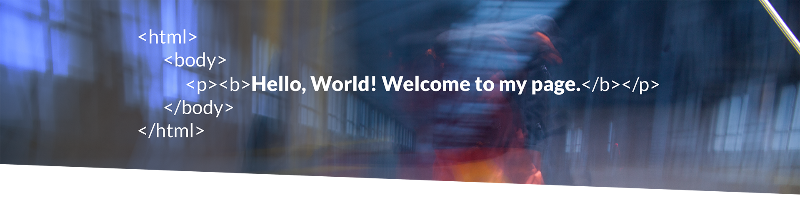

<!-- HEADER -->

<!-- SOCIAL MEDIA -->

  

<!-- VISITOR BADGE -->

  

<!-- ABOUT ME -->

<h3 align="left">👩‍💻 About Me</h3>

<h2>I am a veteran industrial designer shifting gears into software development.
   <i>Swapping sketches for HTML and prototypes for responsive code — always with the user in mind.</i>
</h2>
 - 🔭 I’m working <i><b><mark>in the zone</mark></b></i>
 - 📚 I'm currently <I><b><mark>learning how to navigate the world in syntax</b></mark></i>
 - ⚡ In my free time I am <i><b><mark>in full-out-nerd-mode</b></i></mark>

<!-- LANUGAGE AND TOOLS -->

<h3 align="left">🛠 Language and tools</h3>

  
  
  
  
  

<!-- SPOTIFY -->

<h3 align="left">🤘 Listen with me :</h3>

  

<!-- GITHUB STATS -->

<h3 align="left">🔥 My Stats :</h3>

  

<!-- FOOTER -->

